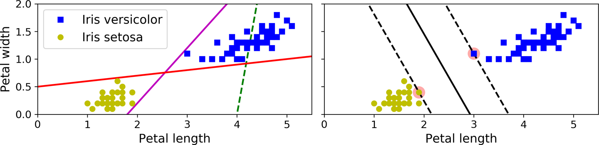
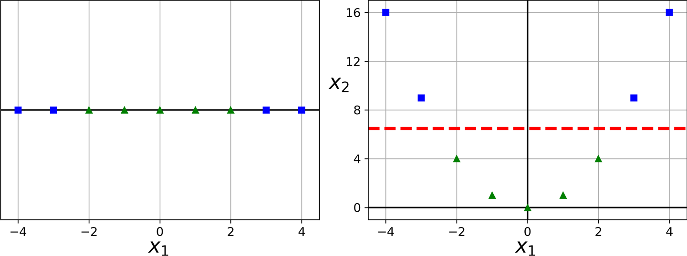
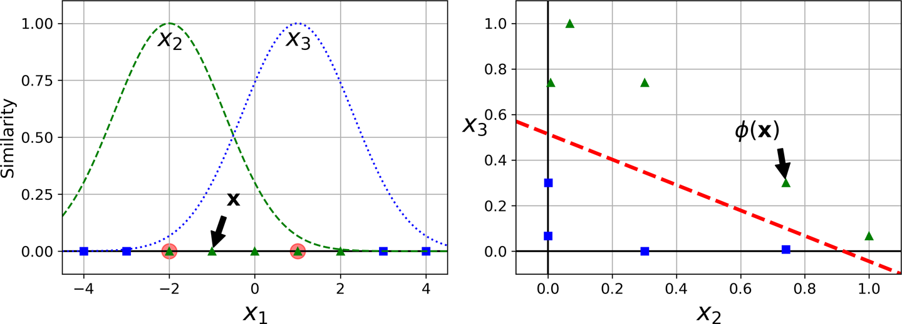

## Support Vector Machine

### Linear SVM Classification
Linear Support Vector machine is known as _large margin classification_ Think of it as fitting the widest possible street between the classes


 Notice that adding more training instances “off the street” will not affect the decision boundary at all: it is fully determined (or “supported”) by the instances located on the edge of the street. These instances are called the support vectors
 
#### Warnings:
    SVMs are sensitive to feature scales, unscaled data might have a much narrower decision boundary

#### Soft Margin Classification
**Hard Margin** 
- imposing that all instance must be off the street and on the right side
- Can only work when data is linearly separable and is sensitive to outliers

**Soft Margin**     
    More flexible model, the objective is to find a good balance between keeping the  street as large as possible and limiting margin violation
    
#### Hyper Parameter:
 
- C: if set to low value More margin violation but generalize better, high value less margin violation but more prone to overfit
    ```TIPS: if SVM overfit, we can regularize it by reducing C```
 
 Two types of implementation:
- kernal method
- Using Gradient descent: (use hinge loss)
    - Pros: Can be useful to handle online classification tasks or huge datasets that doesn't fit in memory
    - Cons: Slower than Kernal method 
    
  
## Non Linear SVM Classification:

- one Approach to handling non linear dataset is to add more feature to make it linearly seperabel


- Another Approach to tackle nonlinear problem is to add features computed using a similarity function,
Which measures how much each instance resembles a particular landmark
eg. For the 1d problem, if we pick 2 landmark at x = -2 and x = 1. And if we use similarity function of Gaussian Radial Basis Function
Given as 
`GaussianRBF(x,l) = exp(-gamma||x - l||^2`  x is datapoint, l is landmark and gamma is hyperparmeter 

a New feature is generated for each landmark and thus form a new dataset



# SVM Regression:

