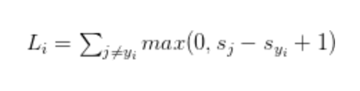

## Hinge Loss

the hinge loss function is summing across all incorrect classes (i \neq j) and comparing the output of our scoring function s returned for the j-th class label (the incorrect class) and the y_{i}-th class (the correct class).

We apply the max operation to clamp values to 0 — this is important to do so that we do not end up summing negative values.

The SVM loss is set up so that the SVM “wants” the correct class for each image to a have a score higher than the incorrect classes by some fixed margin Δ
